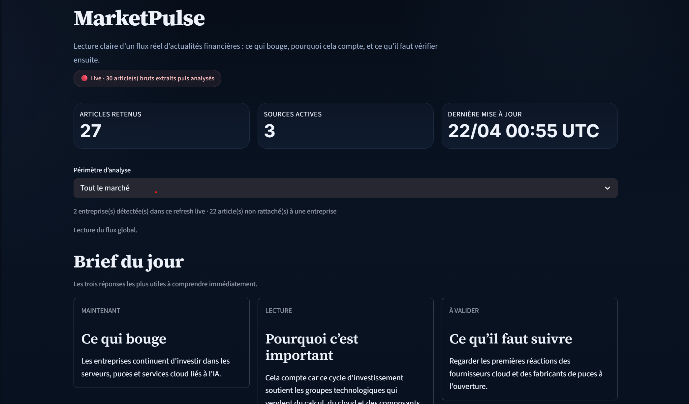

# MarketPulse



**MarketPulse** is a live financial news interpretation engine built with **Python, Streamlit, Pandas, SQLite, and Gemini**.

It transforms a noisy live flow of financial headlines into a structured market brief:
- what matters now
- why it matters
- what to watch next
- which articles actually support the interpretation

---

## Why I built it

Financial news is noisy.

A reader can open a feed with dozens of headlines and still struggle to answer simple questions:

- What is the main signal today
- Is it strong or still fragile
- Which companies are actually involved
- Which articles really support the story

\- What should be checked next before drawing conclusions


I built MarketPulse to solve that problem by turning a \*\*live news flow\*\* into a \*\*clear, recruiter-facing product\*\* that demonstrates both:

\- \*\*data pipeline engineering\*\*

\- \*\*product-oriented interpretation\*\*


\---


\## Core idea


MarketPulse does not rely on a fake demo dataset.


It works from a \*\*real live flow of financial news\*\*, then applies a pipeline that:

1\. extracts articles from RSS sources

2\. cleans and structures titles

3\. removes exact and fuzzy duplicates

4\. maps articles to companies and market narratives

5\. scores and ranks supporting evidence

6\. produces a market brief with a primary signal, secondary signals, and profile-based interpretation


\---


\## Features


\- \*\*Live news extraction\*\* from financial RSS feeds

\- \*\*Cleaning and normalization\*\* of raw article titles

\- \*\*Exact and fuzzy deduplication\*\*

\- \*\*Entity mapping\*\* to companies and market narratives

\- \*\*Primary market signal\*\* generation

\- \*\*Secondary signal\*\* detection

\- \*\*Audience-based reading\*\* by user profile

\- \*\*Evidence reranking\*\* with Gemini

\- \*\*LLM-assisted rewriting\*\* to improve clarity while staying grounded

\- \*\*Methodology section\*\* explaining how the product thinks

\- \*\*Proof section\*\* exposing the underlying pipeline outputs


\---


\## Product structure


\### 1. Brief du jour

Three fast answers:

\- what is moving

\- why it matters

\- what to validate next


\### 2. Note de marché

The main market signal extracted from the live flow.


\### 3. Secondary signals

Two additional signals worth keeping an eye on.


\### 4. Profile-based interpretation

The same market signal translated for different user profiles.


\### 5. Methodology

A visible explanation of the pipeline:

RSS → cleaning → deduplication → mapping → evidence reranking → final brief


\### 6. Verification layer

A proof section showing:

\- source health

\- retained articles

\- local history

\- duplicate removal stats


\---


\## Tech stack


\- \*\*Python\*\*

\- \*\*Streamlit\*\*

\- \*\*Pandas\*\*

\- \*\*SQLite\*\*

\- \*\*RSS feeds\*\*

\- \*\*Gemini API\*\*


\---


\## Project architecture


```text

MarketPulse

├── app.py

├── requirements.txt

├── src/

│   ├── fetch\_news.py

│   ├── clean\_news.py

│   ├── deduplicate.py

│   ├── entity\_mapper.py

│   ├── sentiment.py

│   ├── narratives.py

│   ├── interpreter.py

│   ├── personas.py

│   ├── pulse.py

│   ├── storage.py

│   ├── llm\_layer.py

│   └── llm\_writer.py

└── data/

